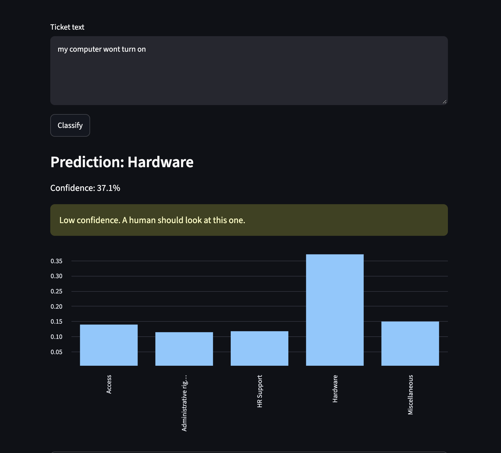
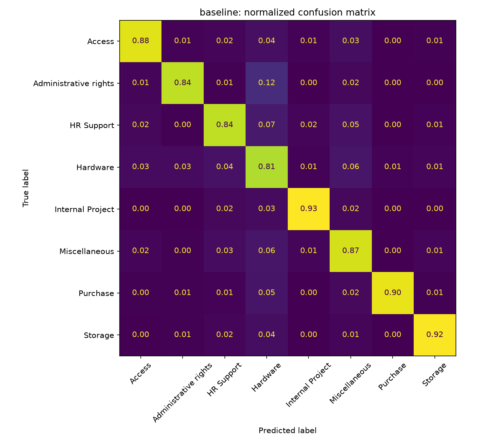

# IT Ticket Classifier

Classifies IT support tickets into categories from the ticket text alone. Built as an end-to-end NLP project: cleaning, a baseline, a fine-tuned transformer, error analysis, and a live demo.

**Live demo:** https://ticket-classifier-fdjq2z8x8djyydjnmzkniu.streamlit.app 



## Why this project
I work help desk, so I see how much time goes into sorting and routing tickets before anyone fixes anything. This tests how well a model can do the first triage step.

## Data
Public ticket dataset from Kaggle: [IT Service Ticket Classification Dataset](https://www.kaggle.com/datasets/adisongoh/it-service-ticket-classification-dataset) by adisongoh on Kaggle. No data from my employer was used.
- 47,837 tickets across 8 categories after cleaning
- Exact duplicate tickets removed before splitting so the same ticket can't appear in both train and test
- Stratified 80/20 train/test split, fixed seed

## Approach
| Model | Details |
|---|---|
| Majority class | always predicts the most common category (floor to beat) |
| TF-IDF + Logistic Regression | word and bigram features, balanced class weights, 5-fold CV on train |
| DistilBERT (fine-tuned) | 3 epochs, max length 128, same split as above |

## Results (held-out test set)
| Model | Accuracy | Macro F1 |
|---|---|---|
| Majority class | 0.2847 | n/a |
| TF-IDF + LogReg | 0.8546 | 0.8578 |
| DistilBERT | DistilBERT | 0.8880 | 0.8861 |

Macro F1 is the number to look at. Accuracy hides weak performance on small categories. The baseline's 5-fold CV macro F1 on the training set was 0.851, which closely matches the test score.



## Error analysis 
DistilBERT improved on the baseline by about 3 points on both accuracy (0.888 vs 0.855) and macro F1 (0.886 vs 0.858). The biggest gain was on Administrative rights, where precision rose from 0.72 to 0.84, though recall dipped slightly (0.84 to 0.80). Miscellaneous also improved (F1 0.82 to 0.85). This is a single training run, so I'd treat the gap as real but not precise. The simple model still has a place: it trains in seconds on a laptop and powers the live demo, while DistilBERT took about 20 minutes on a GPU. Next steps: add a confidence threshold that routes uncertain tickets to a human, and try class weighting for the transformer.

## Run it yourself
```bash
git clone https://github.com/bolaolowosago-lab/ticket-classifier.git
cd ticket-classifier
python3 -m venv .venv && source .venv/bin/activate
pip install -r requirements.txt

# put the csv in data/, then:
python3 src/train_baseline.py --data data/tickets.csv --text-col Document --label-col Topic_group
python3 src/train_transformer.py --data data/tickets.csv --text-col Document --label-col Topic_group

streamlit run app/streamlit_app.py
```
DistilBERT is slow on CPU. Run it in Google Colab (free T4 GPU) if needed.

## Project layout
```
src/        data loading, training scripts, shared evaluation
app/        streamlit demo
results/    metrics, reports, confusion matrices, error csvs
models/     saved baseline model (the app uses this)
```

## Limitations and next steps
- Public ticket data is cleaner than real tickets
- Ideas: priority prediction, class weighting for the transformer, a confidence threshold that routes low-confidence tickets to a human
